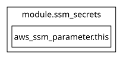

## Requirements

| Name | Version |
|------|---------|
|  [terraform](#requirement\_terraform) | >= 1.15.0 |
|  [aws](#requirement\_aws) | ~> 6.0 |

## Providers

No providers.

## Modules

| Name | Source | Version |
|------|--------|---------|
|  [common\_tags](#module\_common\_tags) | ../../modules/common-tags | n/a |
|  [ssm\_secrets](#module\_ssm\_secrets) | ../../modules/ssm | n/a |

## Resources

No resources.

## Inputs

| Name | Description | Type | Default | Required |
|------|-------------|------|---------|:--------:|
|  [aws\_region](#input\_aws\_region) | AWS Region | `string` | `"eu-west-1"` | no |
|  [secrets](#input\_secrets) | Map of secrets to be stored in SSM | <pre>map(object({     value       = string     description = string     type        = string   }))</pre> | n/a | yes |

## Outputs

| Name | Description |
|------|-------------|
|  [secret\_arns](#output\_secret\_arns) | ARNs of the created SSM parameters |
|  [secret\_names](#output\_secret\_names) | Names of the created SSM parameters |

## Diagram

