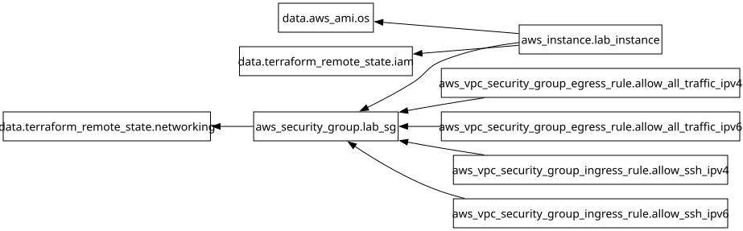

## Features

- **EC2 Instance:** Ubuntu 24.04 ARM64 (Graviton) with Docker and cloudflared.
- **Hermes Workspace:** Bootstraps Docker, Node.js, pnpm, cloudflared, and Bedrock-ready AWS CLI configuration via user_data.
- **Cloudflare Tunnel Token:** Read at boot from an SSM SecureString parameter. Terraform enforces that the shared EC2 projects role has access to the exact environment path prefix before the instance can be planned/applied.
- **Amazon Bedrock:** IAM permissions included for Claude (Sonnet) and Minimax models.
  - *Note:* Model access must be manually enabled in the AWS Console for the target region.

## Operator Contract

Before deploying this project, configure the global IAM foundation with the narrow SSM path prefix for only the environment being deployed. Do not grant all Hermes environment paths to the shared EC2 projects role unless every EC2 project using that instance profile is allowed to read those parameters.

Example for a dev Hermes deployment in `foundation/iam/terraform.tfvars`:

```hcl
ec2_projects_ssm_parameter_paths = ["/hermes/dev"]
```

Then deploy `foundation/iam` before planning/applying this project. The Hermes plan checks `data.terraform_remote_state.iam.outputs.ec2_projects_ssm_parameter_paths` and fails if the configured `cloudflare_tunnel_token_parameter_name[terraform.workspace]` is not under one of those exact prefixes.

## Requirements

| Name | Version |
|------|---------|
| <a name="requirement_terraform"></a> [terraform](#requirement\_terraform) | >= 1.15.0 |
| <a name="requirement_aws"></a> [aws](#requirement\_aws) | ~> 6.0 |

## Providers

| Name | Version |
|------|---------|
| <a name="provider_aws"></a> [aws](#provider\_aws) | 6.46.0 |
| <a name="provider_terraform"></a> [terraform](#provider\_terraform) | n/a |

## Modules

| Name | Source | Version |
|------|--------|---------|
| <a name="module_common_tags"></a> [common\_tags](#module\_common\_tags) | ../../modules/common-tags | n/a |

## Resources

| Name | Type |
|------|------|
| [aws_instance.lab_instance](https://registry.terraform.io/providers/hashicorp/aws/latest/docs/resources/instance) | resource |
| [aws_security_group.lab_sg](https://registry.terraform.io/providers/hashicorp/aws/latest/docs/resources/security_group) | resource |
| [aws_vpc_security_group_egress_rule.allow_all_traffic_ipv4](https://registry.terraform.io/providers/hashicorp/aws/latest/docs/resources/vpc_security_group_egress_rule) | resource |
| [aws_vpc_security_group_egress_rule.allow_all_traffic_ipv6](https://registry.terraform.io/providers/hashicorp/aws/latest/docs/resources/vpc_security_group_egress_rule) | resource |
| [aws_vpc_security_group_ingress_rule.allow_ssh_ipv4](https://registry.terraform.io/providers/hashicorp/aws/latest/docs/resources/vpc_security_group_ingress_rule) | resource |
| [aws_vpc_security_group_ingress_rule.allow_ssh_ipv6](https://registry.terraform.io/providers/hashicorp/aws/latest/docs/resources/vpc_security_group_ingress_rule) | resource |
| [aws_ami.os](https://registry.terraform.io/providers/hashicorp/aws/latest/docs/data-sources/ami) | data source |
| [terraform_remote_state.iam](https://registry.terraform.io/providers/hashicorp/terraform/latest/docs/data-sources/remote_state) | data source |
| [terraform_remote_state.networking](https://registry.terraform.io/providers/hashicorp/terraform/latest/docs/data-sources/remote_state) | data source |

## Inputs

| Name | Description | Type | Default | Required |
|------|-------------|------|---------|:--------:|
| <a name="input_allowed_ssh_cidr_ipv4"></a> [allowed\_ssh\_cidr\_ipv4](#input\_allowed\_ssh\_cidr\_ipv4) | CIDR block allowed for SSH access (IPv4) | `string` | `null` | no |
| <a name="input_allowed_ssh_cidr_ipv6"></a> [allowed\_ssh\_cidr\_ipv6](#input\_allowed\_ssh\_cidr\_ipv6) | CIDR block allowed for SSH access (IPv6) | `string` | `null` | no |
| <a name="input_aws_region"></a> [aws\_region](#input\_aws\_region) | AWS region | `string` | n/a | yes |
| <a name="input_cloudflare_tunnel_token_parameter_name"></a> [cloudflare\_tunnel\_token\_parameter\_name](#input\_cloudflare\_tunnel\_token\_parameter\_name) | SSM SecureString parameter name containing the Cloudflare Tunnel token per environment. | `map(string)` | <pre>{<br/>  "dev": "/hermes/dev/cloudflare_token",<br/>  "prod": "/hermes/prod/cloudflare_token",<br/>  "staging": "/hermes/staging/cloudflare_token"<br/>}</pre> | no |
| <a name="input_enable_ssh_access"></a> [enable\_ssh\_access](#input\_enable\_ssh\_access) | Whether to allow direct SSH ingress. Prefer SSM Session Manager or Cloudflare Tunnel; enable only with narrow CIDRs. | `bool` | `false` | no |
| <a name="input_instance_type"></a> [instance\_type](#input\_instance\_type) | EC2 instance type | `map(string)` | <pre>{<br/>  "dev": "t4g.small",<br/>  "prod": "t4g.large",<br/>  "staging": "t4g.medium"<br/>}</pre> | no |
| <a name="input_key_name"></a> [key\_name](#input\_key\_name) | Name of the SSH key pair in AWS | `map(string)` | <pre>{<br/>  "dev": "keypair_dev",<br/>  "prod": "keypair_prod",<br/>  "staging": "keypair_staging"<br/>}</pre> | no |
| <a name="input_lab_volume_size"></a> [lab\_volume\_size](#input\_lab\_volume\_size) | Size of the root volume in GB | `map(number)` | <pre>{<br/>  "dev": 20,<br/>  "prod": 50,<br/>  "staging": 50<br/>}</pre> | no |
| <a name="input_project"></a> [project](#input\_project) | Project name | `string` | `"hermes"` | no |

## Outputs

| Name | Description |
|------|-------------|
| <a name="output_instance_id"></a> [instance\_id](#output\_instance\_id) | EC2 instance ID |
| <a name="output_instance_public_dns"></a> [instance\_public\_dns](#output\_instance\_public\_dns) | Public DNS assigned to the instance |
| <a name="output_instance_public_ip"></a> [instance\_public\_ip](#output\_instance\_public\_ip) | Public IP assigned to the instance |
| <a name="output_security_group_id"></a> [security\_group\_id](#output\_security\_group\_id) | Security group ID |

## Diagram


